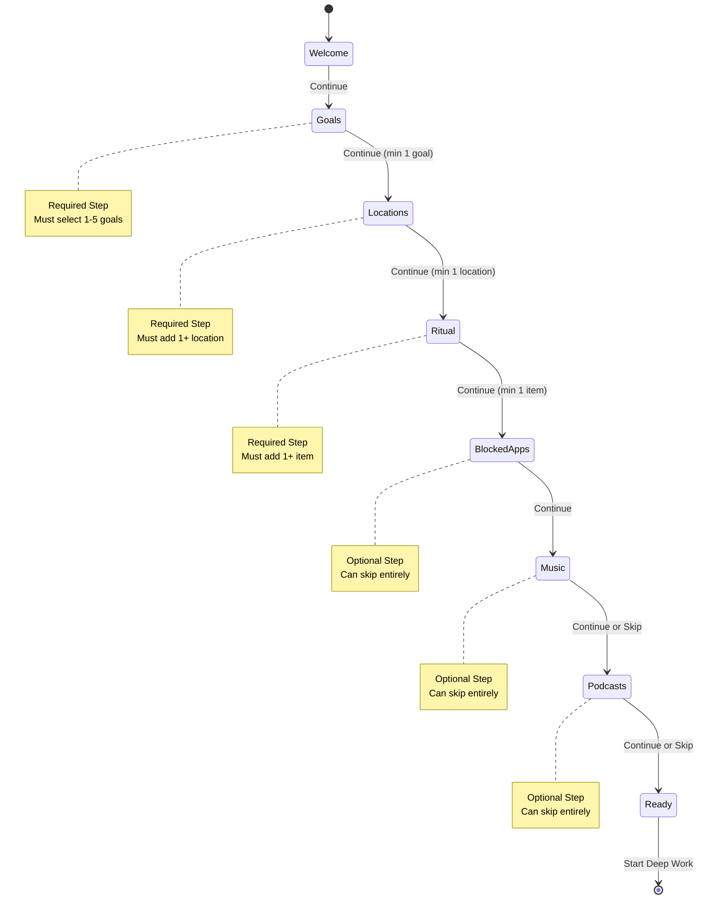

# Onboarding Workflow - 8 Screens to Deep Work Mastery

## Overview

Complete onboarding flow that transforms new users from skeptical visitors to confident deep work practitioners. The flow balances required setup with optional enhancements, ensuring users can start quickly while building habits gradually.

## Design Principles

1. **Progressive Disclosure**: Show only what's needed at each step
2. **Quick Start**: Allow skipping optional steps to reduce friction
3. **Visual Progress**: Clear indication of completion status
4. **Contextual Help**: Inline explanations without overwhelming
5. **Smooth Transitions**: Framer Motion animations between screens
6. **Mobile-First**: Responsive design for all devices

## Onboarding State Machine



## Screen Definitions

### 1. Welcome Screen
**Purpose**: First impression and value proposition

**Content**:
- Hero animation (breathing circle or productivity graphic)
- Headline: "Welcome to Deep Work Mastery"
- Subheadline: "Build unshakeable focus in 8 simple steps"
- 3 key benefits:
  - 🎯 Structure your day for maximum impact
  - 🚫 Eliminate distractions automatically
  - 📈 Track your deep work progress
- CTA: "Let's Get Started" (primary button)

**Validation**: None
**Transitions**: → Goals

**Implementation**:
```tsx
<OnboardingScreen step="welcome">
  <MotionDiv variants={fadeInUp}>
    <BreathingCircle size="lg" />
    <h1>Welcome to Deep Work Mastery</h1>
    <p>Build unshakeable focus in 8 simple steps</p>
    <BenefitsList />
    <Button onClick={nextStep}>Let's Get Started</Button>
  </MotionDiv>
</OnboardingScreen>
```

---

### 2. Goals Screen
**Purpose**: Define focus areas for deep work

**Content**:
- Progress indicator: 1/8 complete
- Headline: "What do you want to focus on?"
- Subheadline: "Select 1-5 areas where you want to build deep work habits"
- Goal options (multi-select):
  - 💻 Software Development
  - 📝 Writing & Content
  - 🎨 Design & Creative
  - 📊 Data & Analysis
  - 🔬 Research & Learning
  - 💼 Business & Strategy
  - 🎓 Academic Study
  - 🎵 Music & Audio
  - 📱 Product Development
  - 🌟 Personal Projects
- Selected count: "2/5 selected"
- CTA: "Continue" (disabled until 1+ selected)

**Validation**:
- Minimum: 1 goal
- Maximum: 5 goals
- Show error if clicking Continue with 0 selected

**State Update**:
```ts
onboardingStore.setGoals(selectedGoals)
```

**Transitions**: Goals → Locations

---

### 3. Flow Locations Screen
**Purpose**: Set up geofencing for automatic flow mode

**Content**:
- Progress indicator: 2/8 complete
- Headline: "Where do you do your best work?"
- Subheadline: "We'll auto-enable focus mode when you're here"
- Location list (empty state):
  - Icon: 📍
  - Text: "No locations yet. Add your first workspace!"
- Add location form:
  - Name input: "e.g., Home Office, Library, Coffee Shop"
  - Location picker: Use browser geolocation API
  - Radius slider: 50m - 500m (default 100m)
- Added locations preview:
  - Name, address, radius
  - Edit/Delete actions
- CTA: "Continue" (disabled until 1+ added)

**Validation**:
- Minimum: 1 location
- Maximum: 5 locations
- Each location needs name + coordinates
- Handle geolocation permission denial gracefully

**State Update**:
```ts
onboardingStore.setLocations(locations)
```

**API Call**:
```ts
POST /api/locations
{
  name: string
  latitude: number
  longitude: number
  radius: number
}
```

**Transitions**: Locations → Ritual

---

### 4. Shutdown Ritual Screen
**Purpose**: Create evening routine for better sleep and next-day prep

**Content**:
- Progress indicator: 3/8 complete
- Headline: "Build your shutdown ritual"
- Subheadline: "End each day intentionally for better recovery"
- Why it matters:
  - 🧠 Clears mental clutter
  - 😴 Improves sleep quality
  - ⏰ Reduces morning anxiety
- Ritual item input:
  - Placeholder: "e.g., Brain dump worries, Set tomorrow's top 3, Charge devices"
  - Add button
- Common suggestions (click to add):
  - "Review what I accomplished today"
  - "Write down 3 priorities for tomorrow"
  - "Brain dump any lingering thoughts"
  - "Set alarm for wake-up time"
  - "Plug in devices to charge"
  - "Plan tomorrow's first deep work block"
- Ritual items list (drag to reorder):
  - Order number
  - Text
  - Checkbox (for later completion)
  - Delete button
- CTA: "Continue" (disabled until 1+ added)

**Validation**:
- Minimum: 1 ritual item
- Maximum: 10 items
- Each item max 100 characters

**State Update**:
```ts
onboardingStore.setRitualItems(items)
```

**API Call**:
```ts
POST /api/ritual
{
  items: Array<{
    text: string
    order: number
  }>
}
```

**Transitions**: Ritual → BlockedApps

---

### 5. Blocked Apps Screen
**Purpose**: Identify distraction sources to block during flow

**Content**:
- Progress indicator: 4/8 complete
- Headline: "What steals your focus?"
- Subheadline: "We'll block these during deep work sessions (optional)"
- Skip option: "Skip - I'll add these later" (top-right)
- App categories (expandable):
  - 📱 Social Media
    - Twitter/X, Instagram, Facebook, TikTok, LinkedIn
  - 🎬 Entertainment
    - YouTube, Netflix, Hulu, Disney+, Twitch
  - 💬 Messaging
    - Slack, Discord, WhatsApp, Telegram, Messages
  - 📰 News & Media
    - Reddit, Hacker News, Medium, News sites
  - 🎮 Gaming
    - Steam, Epic Games, Gaming sites
- Each app:
  - Checkbox (select multiple)
  - App icon + name
  - Domain preview (e.g., twitter.com)
- Custom app option:
  - Name input
  - Domain input
  - Category select
- Selected count: "8 apps selected"
- CTA: "Continue" (always enabled)

**Validation**:
- Optional step (can select 0)
- Custom apps require name + domain
- Domain format validation (URL)

**State Update**:
```ts
onboardingStore.setBlockedApps(apps)
```

**API Call**:
```ts
POST /api/blocked-apps
{
  apps: Array<{
    name: string
    domain: string
    category: string
    enabled: boolean
  }>
}
```

**Transitions**: BlockedApps → Music

---

### 6. Music Preferences Screen
**Purpose**: Set up focus music for flow sessions

**Content**:
- Progress indicator: 5/8 complete
- Headline: "What music helps you focus?"
- Subheadline: "We'll suggest playlists during deep work (optional)"
- Skip option: "Skip - I prefer silence" (top-right)
- Music service selection:
  - Spotify (icon + name)
  - Apple Music
  - YouTube Music
  - None (silence)
- Genre preferences (if service selected):
  - ☑️ Instrumental
  - ☑️ Classical
  - ☑️ Lo-fi
  - ☑️ Electronic/Ambient
  - ☑️ Jazz
  - ☑️ Nature Sounds
  - ☑️ White Noise
- Preview example playlist (if genre selected)
- CTA: "Continue" (always enabled)

**Validation**:
- Optional step (can skip entirely)
- Service + genres saved if selected

**State Update**:
```ts
onboardingStore.setMusicPreferences({
  service: string | null
  genres: string[]
})
```

**Transitions**: Music → Podcasts

---

### 7. Podcast Preferences Screen
**Purpose**: Set up educational podcasts for learning during breaks

**Content**:
- Progress indicator: 6/8 complete
- Headline: "What do you want to learn about?"
- Subheadline: "We'll suggest podcasts during breaks (optional)"
- Skip option: "Skip - I don't listen to podcasts" (top-right)
- Podcast categories (multi-select):
  - 💻 Technology & Programming
  - 🚀 Startups & Business
  - 🧠 Psychology & Productivity
  - 🔬 Science & Research
  - 🎨 Design & Creativity
  - 💼 Career Development
  - 📚 Books & Literature
  - 🌍 Current Events
  - 🎓 Education & Learning
- Selected count: "3 categories selected"
- Preview suggested podcasts (if categories selected)
- CTA: "Continue" (always enabled)

**Validation**:
- Optional step (can select 0)
- Save selections if any made

**State Update**:
```ts
onboardingStore.setPodcastGenres(genres)
```

**API Call**:
```ts
PATCH /api/user/preferences
{
  podcastGenres: string[]
}
```

**Transitions**: Podcasts → Ready

---

### 8. Ready Screen
**Purpose**: Completion celebration and first action

**Content**:
- Progress indicator: 8/8 complete ✨
- Success animation (confetti or checkmark burst)
- Headline: "You're all set! 🎉"
- Subheadline: "Your deep work system is ready to go"
- Quick recap:
  - ✅ Focus areas defined: [2 goals]
  - ✅ Flow locations: [3 places]
  - ✅ Shutdown ritual: [5 items]
  - ✅ [8 apps] will be blocked during flow
  - ✅ Music preferences saved
  - ✅ Podcast interests saved
- Next steps preview:
  - "1. Schedule your first deep work block"
  - "2. Enable the Chrome extension"
  - "3. Start your first flow session"
- CTA: "Start Deep Work" (primary, large button)
- Secondary: "Review Settings" (ghost button)

**Validation**: None

**State Update**:
```ts
onboardingStore.setComplete(true)
// Update user record
PATCH /api/user/onboarding
{
  onboardingComplete: true
}
```

**Transitions**: Ready → Dashboard (main app)

---

## State Machine Implementation

### Onboarding Store (Zustand)

```typescript
interface OnboardingStep {
  id: string
  title: string
  required: boolean
  completed: boolean
}

interface OnboardingState {
  // Current state
  currentStep: number
  steps: OnboardingStep[]

  // Data
  goals: string[]
  locations: FlowLocation[]
  ritualItems: RitualItem[]
  blockedApps: BlockedApp[]
  musicPreferences: MusicPreferences | null
  podcastGenres: string[]

  // Progress
  isComplete: boolean
  canContinue: boolean

  // Actions
  nextStep: () => void
  prevStep: () => void
  skipStep: () => void
  goToStep: (step: number) => void

  // Data setters
  setGoals: (goals: string[]) => void
  setLocations: (locations: FlowLocation[]) => void
  setRitualItems: (items: RitualItem[]) => void
  setBlockedApps: (apps: BlockedApp[]) => void
  setMusicPreferences: (prefs: MusicPreferences | null) => void
  setPodcastGenres: (genres: string[]) => void

  // Completion
  setComplete: (complete: boolean) => void

  // Validation
  validateStep: (step: number) => boolean
  getProgress: () => { completed: number; total: number; percent: number }
}
```

### Step Configuration

```typescript
const ONBOARDING_STEPS: OnboardingStep[] = [
  {
    id: 'welcome',
    title: 'Welcome',
    required: false, // Just info screen
    completed: false,
  },
  {
    id: 'goals',
    title: 'Focus Areas',
    required: true,
    completed: false,
  },
  {
    id: 'locations',
    title: 'Flow Locations',
    required: true,
    completed: false,
  },
  {
    id: 'ritual',
    title: 'Shutdown Ritual',
    required: true,
    completed: false,
  },
  {
    id: 'blocked-apps',
    title: 'Blocked Apps',
    required: false, // Can skip
    completed: false,
  },
  {
    id: 'music',
    title: 'Music',
    required: false, // Can skip
    completed: false,
  },
  {
    id: 'podcasts',
    title: 'Podcasts',
    required: false, // Can skip
    completed: false,
  },
  {
    id: 'ready',
    title: 'Ready to Start',
    required: false, // Just completion screen
    completed: false,
  },
]
```

### Validation Logic

```typescript
const validateStep = (step: number, state: OnboardingState): boolean => {
  switch (step) {
    case 0: // Welcome
      return true // No validation

    case 1: // Goals
      return state.goals.length >= 1 && state.goals.length <= 5

    case 2: // Locations
      return state.locations.length >= 1

    case 3: // Ritual
      return state.ritualItems.length >= 1

    case 4: // Blocked Apps (optional)
      return true // Always valid, can skip

    case 5: // Music (optional)
      return true // Always valid, can skip

    case 6: // Podcasts (optional)
      return true // Always valid, can skip

    case 7: // Ready
      return true // No validation

    default:
      return false
  }
}
```

### Skip Logic

```typescript
const canSkipStep = (step: number): boolean => {
  const stepConfig = ONBOARDING_STEPS[step]
  return !stepConfig.required
}

const skipStep = () => {
  if (canSkipStep(currentStep)) {
    // Mark as completed (skipped)
    steps[currentStep].completed = true
    // Move to next
    nextStep()
  }
}
```

## Transition Animations

### Screen Transitions (Framer Motion)

```typescript
const screenVariants = {
  enter: (direction: number) => ({
    x: direction > 0 ? 1000 : -1000,
    opacity: 0,
  }),
  center: {
    x: 0,
    opacity: 1,
  },
  exit: (direction: number) => ({
    x: direction < 0 ? 1000 : -1000,
    opacity: 0,
  }),
}

const screenTransition = {
  type: 'spring',
  stiffness: 300,
  damping: 30,
}
```

### Progress Indicator

```typescript
const ProgressIndicator = ({ steps, currentStep }: Props) => {
  const progress = (currentStep / (steps.length - 1)) * 100

  return (
    <div className="w-full max-w-2xl mx-auto mb-8">
      {/* Progress bar */}
      <div className="h-2 bg-gray-200 rounded-full overflow-hidden">
        <motion.div
          className="h-full bg-blue-600"
          initial={{ width: 0 }}
          animate={{ width: `${progress}%` }}
          transition={{ duration: 0.5, ease: 'easeInOut' }}
        />
      </div>

      {/* Step indicators */}
      <div className="flex justify-between mt-4">
        {steps.map((step, index) => (
          <div
            key={step.id}
            className={cn(
              'flex flex-col items-center',
              index === currentStep && 'text-blue-600',
              step.completed && 'text-green-600'
            )}
          >
            <div
              className={cn(
                'w-8 h-8 rounded-full flex items-center justify-center',
                index === currentStep && 'bg-blue-600 text-white',
                step.completed && 'bg-green-600 text-white',
                index !== currentStep && !step.completed && 'bg-gray-200'
              )}
            >
              {step.completed ? '✓' : index + 1}
            </div>
            <span className="text-xs mt-2">{step.title}</span>
          </div>
        ))}
      </div>
    </div>
  )
}
```

## API Integration

### Save Onboarding Data

```typescript
const saveOnboardingData = async (data: OnboardingData) => {
  // Save goals
  await fetch('/api/user/goals', {
    method: 'POST',
    body: JSON.stringify({ goals: data.goals }),
  })

  // Save locations
  for (const location of data.locations) {
    await fetch('/api/locations', {
      method: 'POST',
      body: JSON.stringify(location),
    })
  }

  // Save ritual items
  await fetch('/api/ritual', {
    method: 'POST',
    body: JSON.stringify({ items: data.ritualItems }),
  })

  // Save blocked apps
  if (data.blockedApps.length > 0) {
    await fetch('/api/blocked-apps', {
      method: 'POST',
      body: JSON.stringify({ apps: data.blockedApps }),
    })
  }

  // Save music preferences
  if (data.musicPreferences) {
    await fetch('/api/user/preferences', {
      method: 'PATCH',
      body: JSON.stringify({ music: data.musicPreferences }),
    })
  }

  // Save podcast genres
  if (data.podcastGenres.length > 0) {
    await fetch('/api/user/preferences', {
      method: 'PATCH',
      body: JSON.stringify({ podcastGenres: data.podcastGenres }),
    })
  }

  // Mark onboarding complete
  await fetch('/api/user/onboarding', {
    method: 'PATCH',
    body: JSON.stringify({ onboardingComplete: true }),
  })
}
```

## Persistence Strategy

1. **Auto-save on Step Completion**: Save data when moving to next step
2. **Local Storage Backup**: Store progress in localStorage for recovery
3. **Server Sync**: Sync with server on each step completion
4. **Resume Support**: If user leaves and returns, resume from last completed step

```typescript
// Save to localStorage on each step
useEffect(() => {
  localStorage.setItem('onboarding-progress', JSON.stringify({
    currentStep,
    goals,
    locations,
    ritualItems,
    blockedApps,
    musicPreferences,
    podcastGenres,
  }))
}, [currentStep, goals, locations, ritualItems, blockedApps, musicPreferences, podcastGenres])

// Resume from localStorage on mount
useEffect(() => {
  const saved = localStorage.getItem('onboarding-progress')
  if (saved) {
    const progress = JSON.parse(saved)
    // Restore state
    onboardingStore.setState(progress)
  }
}, [])
```

## Error Handling

1. **Validation Errors**: Show inline error messages
2. **API Errors**: Retry with exponential backoff
3. **Network Offline**: Queue saves for when online
4. **Geolocation Denied**: Offer manual location entry
5. **Session Expired**: Redirect to login, preserve progress

## Accessibility

1. **Keyboard Navigation**: Tab through all interactive elements
2. **Screen Reader Support**: ARIA labels and live regions
3. **Focus Management**: Auto-focus on next input after Continue
4. **Error Announcements**: Announce validation errors to screen readers
5. **Skip Links**: "Skip to content" for each screen

## Mobile Optimization

1. **Touch-friendly**: Large tap targets (min 44x44px)
2. **Swipe Support**: Swipe left/right to navigate steps
3. **Native Inputs**: Use device-appropriate pickers (location, etc.)
4. **Responsive Layout**: Stack vertically on mobile
5. **Bottom CTA**: Fixed bottom button bar on mobile

## Testing Checklist

- [ ] Can complete full flow with all steps
- [ ] Can skip optional steps (apps, music, podcasts)
- [ ] Cannot skip required steps (goals, locations, ritual)
- [ ] Validation prevents advancing with incomplete required steps
- [ ] Progress indicator updates correctly
- [ ] Animations smooth on all devices
- [ ] Data persists across page refreshes
- [ ] Data saves to server correctly
- [ ] Can resume from last step after leaving
- [ ] Error states handled gracefully
- [ ] Works offline (with queued saves)
- [ ] Accessible via keyboard only
- [ ] Screen reader compatible
- [ ] Mobile responsive
- [ ] Geolocation permission handled
